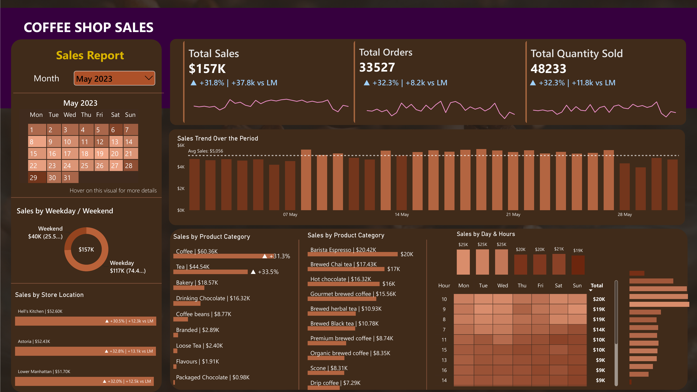

# ☕ Coffee Shop Sales — Power BI Dashboard

An end-to-end Power BI dashboard analyzing ~149K coffee shop transactions
(Jan–Jun 2023) across 3 New York store locations — built to satisfy a
defined set of KPI and charting requirements (see
[`business_requirements.txt`](business_requirements.txt)).

---

## 📊 Preview



---

## 🧠 What this project is

A retail sales dashboard built in Power BI on top of a raw transactions
export, designed around a fixed brief of 3 KPI requirements and 7 chart
requirements (weekday/weekend split, calendar heat map, store-location
comparison, daily trend with average line, category/product breakdowns,
and a day×hour heat map). The full requirements are in
[`business_requirements.txt`](business_requirements.txt).

## 🎯 Why I built it this way

- **Month-on-month comparison is the recurring ask** (sales, orders,
  quantity all need MoM % and absolute diff) — so instead of writing three
  separate one-off calculations, I built a consistent MoM pattern
  (`MoM Growth & Diff Sales/Orders/Quantity`) and reused it wherever a
  requirement needed "vs. previous month."
- **Two dedicated tooltip pages** ("Calender Visual Tooltip" and
  "Day & Hour Chart Tooltip") instead of cramming detail into the base
  visuals — this keeps the main dashboard clean while still satisfying the
  "show Sales/Orders/Quantity on hover" requirement exactly as specified.
- **A single Month Year slicer drives the whole page** (calendar, daily
  trend, store comparison), so every visual stays in sync rather than each
  chart having its own independent filter context.
- **Conditional-formatting placeholder measures** (`Colour For Bars`, `New
  MoM Label`, `Placeholder`) exist purely to drive dynamic
  coloring/labeling (e.g. darker calendar cells for higher sales, bars
  colored by above/below MoM trend) — Power BI's built-in conditional
  formatting needs a measure to bind to, so these exist as small
  DAX helpers rather than being real KPIs themselves.

## 🛠️ How I built it

**Source data:** `Coffee Shop Sales.xlsx` — one row per transaction line
item: `transaction_id`, `transaction_date`, `transaction_time`,
`transaction_qty`, `store_id`, `store_location`, `product_id`,
`unit_price`, `product_category`, `product_type`, `product_detail`.

**Report structure (`BI PROJECT COFFEE new.pbix`):**

- **Page 1 — main dashboard** (see screenshot above)
  - **Month slicer + calendar** — a dropdown to pick the reporting month,
    with a mini calendar grid below it shaded by daily sales intensity;
    hovering a day surfaces the tooltip page for that date
  - **KPI cards** — Total Sales, Total Orders, Total Quantity Sold, each
    with a MoM % and absolute-diff badge and a sparkline trend
  - **Sales Trend Over the Period** — daily sales for the selected month
    as a bar chart, with a dashed average-sales reference line so days
    above/below average stand out
  - **Sales by Weekday / Weekend** — donut chart splitting total sales
    between weekday and weekend
  - **Sales by Store Location** — bar chart comparing the three stores
    (Hell's Kitchen, Astoria, Lower Manhattan), each with its own MoM
    diff badge
  - **Sales by Product Category** (×2 panels) — one at the category level
    (Coffee, Tea, Bakery, ...) and one drilled to product type within
    category (Barista Espresso, Brewed Chai Tea, ...), both ranked by sales
  - **Sales by Day & Hours** — a small-multiples row of hourly totals plus
    a Day × Hour heat map table, darker cells indicating busier slots,
    with hover tooltips for detailed metrics
- **Calender Visual Tooltip page** — Total Sales/Orders/Quantity cards +
  donut + MoM vs. last month, shown when hovering a calendar day
- **Day & Hour Chart Tooltip page** — same card/donut layout, shown when
  hovering a cell in the Day × Hour heat map

**Key DAX measures:**

| Measure | Purpose |
|---|---|
| `Total Sales` | `SUM(unit_price * transaction_qty)` |
| `Total Orders` | Distinct count of `transaction_id` |
| `Total Quantity Sold` | `SUM(transaction_qty)` |
| `Daily Avg Sales` | Average daily sales for the selected month, used for the average-line highlight |
| `MoM Growth & Diff Sales` | Sales vs. previous month — % and absolute difference |
| `MoM Growth & Diff Orders` | Same pattern, applied to order count |
| `MoM Growth & Diff Quantity` | Same pattern, applied to quantity sold |
| `Colour For Bars` | Drives conditional formatting on the calendar heat map |
| `Label for Product Type / Store Location / Product Category` | Dynamic axis labels used across the category/store/product breakdown charts |

**Tools used:** Power BI Desktop (data modeling, DAX, report design),
Excel (source data).

---

## 📁 Repo contents

```
├── BI PROJECT COFFEE new.pbix     # Power BI report (data model + visuals)
├── BI PROJECT COFFEE.pdf          # Static PDF export of the report
├── Coffee Shop Sales.xlsx         # Source transaction data
├── business_requirements.txt      # KPI & chart requirements this report satisfies
├── screenshots/                   # Dashboard screenshot(s) used in this README
└── README.md
```
